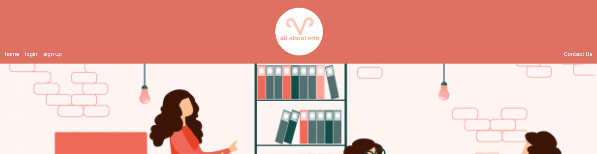
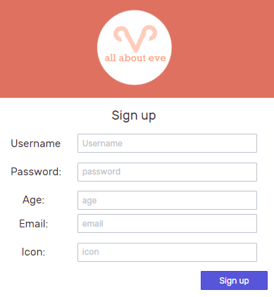
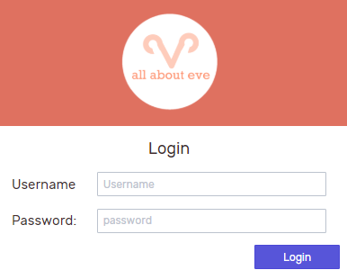
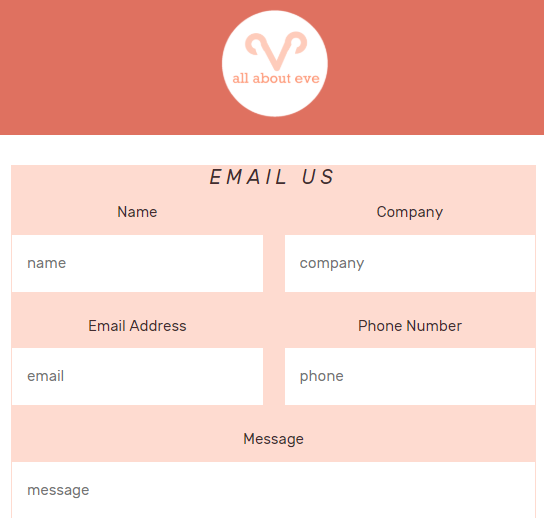
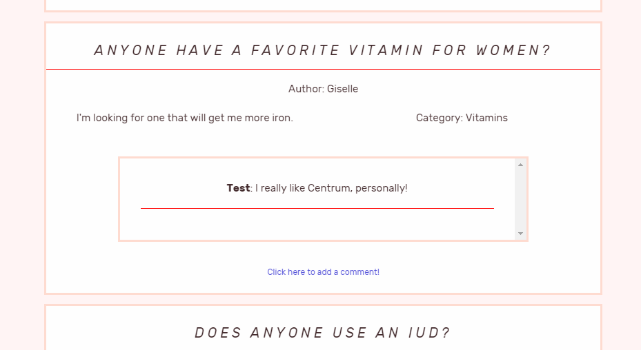
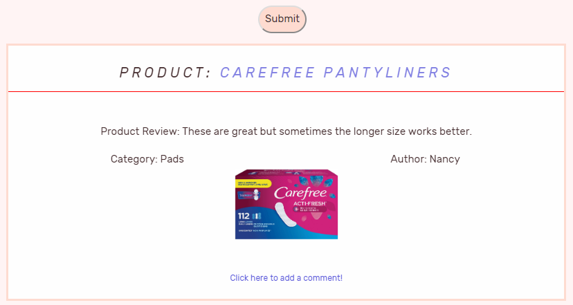
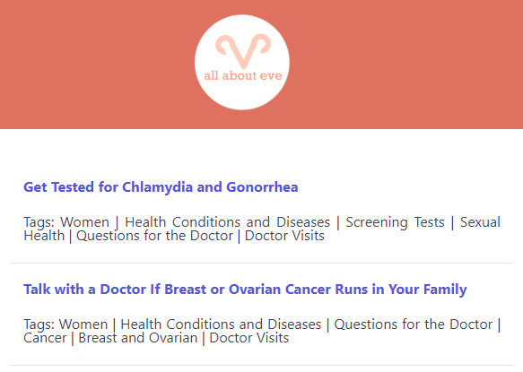

# all-about-eve
Heroku link: https://radiant-hamlet-57340.herokuapp.com/

Test user:

username: Billie
 
password: billie42

# Project Goal

All About Eve is a crowd-sourcing health page by women, for women. We wanted to create a space for women to discuss women's health issues and products openly and frankly. 

# Flow

The homepage of All About Eve provides some inspiration for what users can discuss on the app. 

First, the user creates an account. Presently, username, password, and email are the only required fields.

Once the user has created an account, they will be redirected to the login page, at which point they login and then have access to the protected content of the site: the Forum, the Product Review page, and the Articles page.

Whether logged in or out, the user has access to the Contact Us page, which allows them to send an email to the All About Eve team with questions about the sites or suggestions. 

The user can log out at any time. Their posts and comments will be visible to any user who is logged in.

# Sections

## Forum

The Forum allows users to post a question about women's health and answer other users' questions. They can enter a question and details at the top of the page, and the post will display at the top. Each post has a space for any user to add their comments. 

## Product Review

The Product Review section allows users to post reviews of women's health related products and medicines and to comment on other users' reviews. The user can include the product name, a link to an image of the product, and their review of the product.

## Articles

The Articles section allows users to browse various articles imported from https://healthfinder.gov/FreeContent/Developer/Contents.aspx. The articles from healthfinder.gov have been filtered to display articles related to women's health.

# Technology

## Front End
* HTML5
* CSS3
* React.js
* React Bootstrap
* React Parallax

## Back End

* Node.js
* Node Express
* MongoDB
* Mongoose
* bcrypt
* Passport
* Nodemailer
* Google Gmail API

# Potential Improvements
* In the future we would need to create an Admin login that has the abiltiy to set users to active or inactive and to moderate the forum and product pages. Right now users can post whatever content they want, so if someone wanted to make a post about the latest Riverdale episode, they could, but it wouldn't exactly be relevant to the discussion of women's health. Not to mention linking unsavory images on the product page! So we need an admin access that can delete posts if they are not relevant to the discussion, or if they are offensive, use hate speech, etc. etc. 
* We've included an 'icon' option in the signup page so that in the future a user could use their own avatar or select from icons we provide. 
* In the Forum and Product pages, we'd like to add a sorting feature for the content. Presently both pages display all existing posts, but we would like to incorporate a tag system that would allow users to tag their posts by category, and allow users to search for posts containing those tags.
* Add validation for forum and product entries
* Add the ability for users to edit or delete their posts (on the backend they would really be archiving their posts  we'd save the data but it wouldn't be displayed) 

# Authors
Saikal Asylbekova (Github: 7saikal; Email: ), Nora Byrd (Github: noracbyrd; Email: noracbyrd@gmail.com), GG Guitart (Github: gguitart; Email: guitart.gg@gmail.com), Giovanna Roman (Github: gromanbb; Email: gromanbb@gmail.com) 
